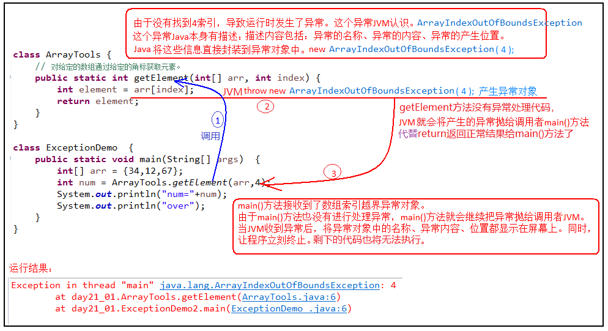
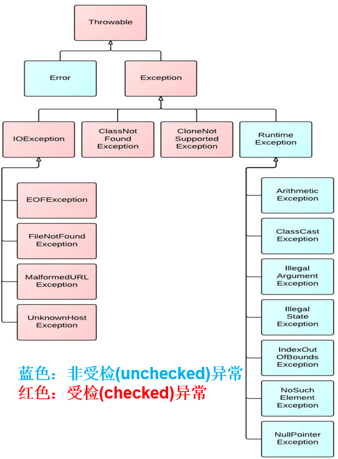
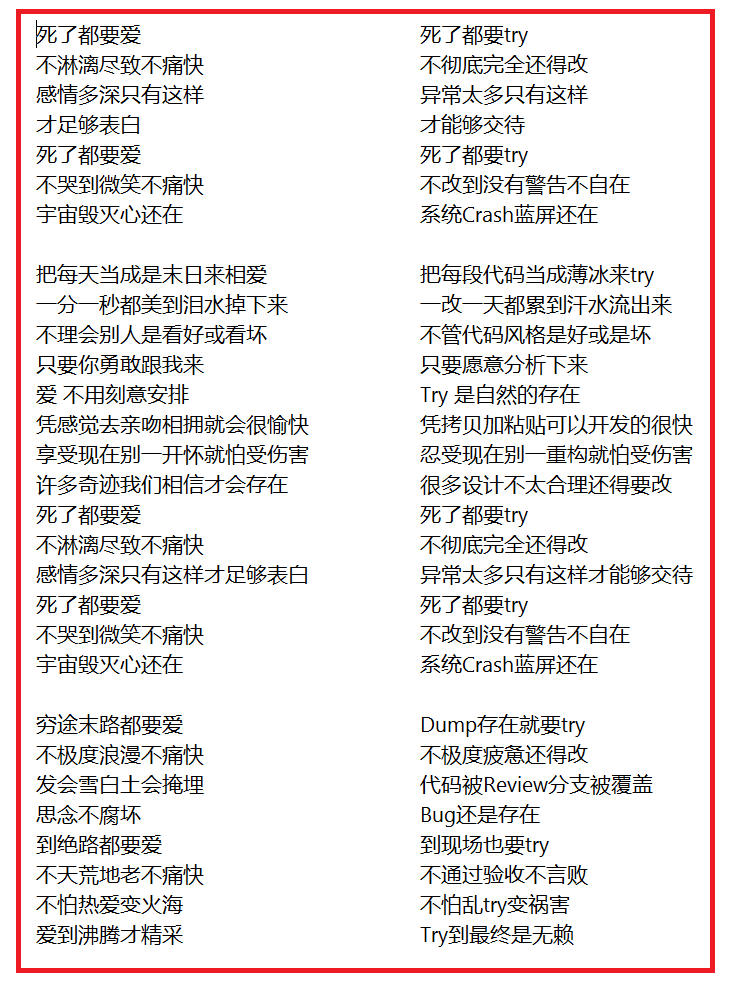

# 第 09 章\_异常处理

讲师：尚硅谷-宋红康（江湖人称：康师傅）

官网：[http://www.atguigu.com](http://www.atguigu.com/)

## 本章专题与脉络


## 1. 异常概述

### 1.1 什么是生活的异常

男主角小明每天开车上班，正常车程 1 小时。但是，不出意外的话，可能会出现意外。


出现意外，即为异常情况。我们会做相应的处理。如果不处理，到不了公司。处理完了，就可以正常开车去公司。


### 1.2 什么是程序的异常

在使用计算机语言进行项目开发的过程中，即使程序员把代码写得`尽善尽美`，在系统的运行过程中仍然会遇到一些问题，因为很多问题不是靠代码能够避免的，比如：`客户输入数据的格式问题`，`读取文件是否存在`，`网络是否始终保持通畅`等等。

- **异常** ：指的是程序在执行过程中，出现的非正常情况，如果不处理最终会导致 JVM 的非正常停止。

> 异常指的并不是语法错误和逻辑错误。语法错了，编译不通过，不会产生字节码文件，根本不能运行。
>
> 代码逻辑错误，只是没有得到想要的结果，例如：求 a 与 b 的和，你写成了 a-b

### 1.3 异常的抛出机制

Java 中是如何表示不同的异常情况，又是如何让程序员得知，并处理异常的呢？

Java 中把不同的异常用不同的类表示，一旦发生某种异常，就`创建该异常类型的对象`，并且抛出（throw）。然后程序员可以捕获(catch)到这个异常对象，并处理；如果没有捕获(catch)这个异常对象，那么这个异常对象将会导致程序终止。

举例：

运行下面的程序，程序会产生一个数组角标越界异常`ArrayIndexOfBoundsException`。我们通过图解来解析下异常产生和抛出的过程。

```java
public class ArrayTools {
    // 对给定的数组通过给定的角标获取元素。
    public static int getElement(int[] arr, int index) {
        int element = arr[index];
        return element;
    }
}
```

测试类

```java
public class ExceptionDemo {
    public static void main(String[] args) {
        int[] arr = { 34, 12, 67 };
        intnum = ArrayTools.getElement(arr, 4)
        System.out.println("num=" + num);
        System.out.println("over");
    }
}
```

上述程序执行过程图解：



### 1.4 如何对待异常

对于程序出现的异常，一般有两种解决方法：一是遇到错误就终止程序的运行。另一种方法是程序员在编写程序时，就充分考虑到各种可能发生的异常和错误，极力预防和避免。实在无法避免的，要编写相应的代码进行异常的检测、以及`异常的处理`，保证代码的`健壮性`。

## 2. Java 异常体系

### 2.1 Throwable

`java.lang.Throwable` 类是 Java 程序执行过程中发生的异常事件对应的类的根父类。

**Throwable 中的常用方法：**

- `public void printStackTrace()`：打印异常的详细信息。

  包含了异常的类型、异常的原因、异常出现的位置、在开发和调试阶段都得使用 printStackTrace。

- `public String getMessage()`：获取发生异常的原因。

### 2.2 Error 和 Exception

Throwable 可分为两类：Error 和 Exception。分别对应着`java.lang.Error`与`java.lang.Exception`两个类。

**Error：**Java 虚拟机无法解决的严重问题。如：JVM 系统内部错误、资源耗尽等严重情况。一般不编写针对性的代码进行处理。

- 例如：StackOverflowError（栈内存溢出）和 OutOfMemoryError（堆内存溢出，简称 OOM）。

**Exception:** 其它因编程错误或偶然的外在因素导致的一般性问题，需要使用针对性的代码进行处理，使程序继续运行。否则一旦发生异常，程序也会挂掉。例如：

- 空指针访问
- 试图读取不存在的文件
- 网络连接中断
- 数组角标越界

> 说明：
>
> 1. 无论是 Error 还是 Exception，还有很多子类，异常的类型非常丰富。当代码运行出现异常时，特别是我们不熟悉的异常时，不要紧张，把异常的简单类名，拷贝到 API 中去查去认识它即可。
> 2. 我们本章讲的异常处理，其实针对的就是 Exception。


### 2.3 编译时异常和运行时异常

Java 程序的执行分为编译时过程和运行时过程。有的错误只有在`运行时`才会发生。比如：除数为 0，数组下标越界等。


因此，根据异常可能出现的阶段，可以将异常分为：

- **编译时期异常**（即 checked 异常、受检异常）：在代码编译阶段，编译器就能明确`警示`当前代码`可能发生（不是一定发生）`xx 异常，并`明确督促`程序员提前编写处理它的代码。如果程序员`没有编写`对应的异常处理代码，则编译器就会直接判定编译失败，从而不能生成字节码文件。通常，这类异常的发生不是由程序员的代码引起的，或者不是靠加简单判断就可以避免的，例如：FileNotFoundException（文件找不到异常）。
- **运行时期异常**（即 runtime 异常、unchecked 异常、非受检异常）：在代码编译阶段，编译器完全不做任何检查，无论该异常是否会发生，编译器都不给出任何提示。只有等代码运行起来并确实发生了 xx 异常，它才能被发现。通常，这类异常是由程序员的代码编写不当引起的，只要稍加判断，或者细心检查就可以避免。
  - **java.lang.RuntimeException**类及它的子类都是运行时异常。比如：ArrayIndexOutOfBoundsException 数组下标越界异常，ClassCastException 类型转换异常。



## 3. 常见的错误和异常

### 3.1 Error

最常见的就是 VirtualMachineError，它有两个经典的子类：StackOverflowError、OutOfMemoryError。

```java
package com.atguigu.exception;

import org.junit.Test;

public class TestStackOverflowError {
    @Test
    public void test01(){
        //StackOverflowError
        recursion();
    }

    public void recursion(){ //递归方法
        recursion();
    }
}

```

```java
package com.atguigu.exception;

import org.junit.Test;

public class TestOutOfMemoryError {
    @Test
    public void test02(){
        //OutOfMemoryError
        //方式一：
        int[] arr = new int[Integer.MAX_VALUE];
    }
    @Test
    public void test03(){
        //OutOfMemoryError
        //方式二：
        StringBuilder s = new StringBuilder();
        while(true){
            s.append("atguigu");
        }
    }
}

```

### 3.2 运行时异常

```java
package com.atguigu.exception;

import org.junit.Test;

import java.util.Scanner;

public class TestRuntimeException {
    @Test
    public void test01(){
        //NullPointerException
        int[][] arr = new int[3][];
        System.out.println(arr[0].length);
    }

    @Test
    public void test02(){
        //ClassCastException
        Object obj = 15;
        String str = (String) obj;
    }

    @Test
    public void test03(){
        //ArrayIndexOutOfBoundsException
        int[] arr = new int[5];
        for (int i = 1; i <= 5; i++) {
            System.out.println(arr[i]);
        }
    }

    @Test
    public void test04(){
        //InputMismatchException
        Scanner input = new Scanner(System.in);
        System.out.print("请输入一个整数：");//输入非整数
        int num = input.nextInt();
        input.close();
    }

    @Test
    public void test05(){
        int a = 1;
        int b = 0;
        //ArithmeticException
        System.out.println(a/b);
    }
}

```

### 3.3 编译时异常

```java
package com.atguigu.exception;

import org.junit.Test;

import java.io.FileInputStream;
import java.io.FileNotFoundException;
import java.sql.Connection;
import java.sql.DriverManager;
import java.sql.SQLException;

public class TestCheckedException {
    @Test
    public void test06() {
        Thread.sleep(1000);//休眠1秒  InterruptedException
    }

    @Test
    public void test07(){
        Class c = Class.forName("java.lang.String");//ClassNotFoundException
    }

    @Test
    public void test08() {
        Connection conn = DriverManager.getConnection("....");  //SQLException
    }
    @Test
    public void test09()  {
        FileInputStream fis = new FileInputStream("尚硅谷Java秘籍.txt"); //FileNotFoundException
    }
    @Test
    public void test10() {
        File file = new File("尚硅谷Java秘籍.txt");
		FileInputStream fis = new FileInputStream(file);//FileNotFoundException
		int b = fis.read();//IOException
		while(b != -1){
			System.out.print((char)b);
			b = fis.read();//IOException
		}

		fis.close();//IOException
    }
}
```

## 4. 异常的处理

### 4.1 异常处理概述

在编写程序时，经常要在可能出现错误的地方加上检测的代码，如进行 x/y 运算时，要`检测分母为0`，`数据为空`，`输入的不是数据而是字符`等。过多的 if-else 分支会导致程序的`代码加长`、`臃肿`，`可读性差`，程序员需要花很大的精力“`堵漏洞`”。因此采用异常处理机制。

**Java 异常处理**

Java 采用的异常处理机制，是`将异常处理的程序代码集中在一起`，与正常的程序代码分开，使得程序简洁、优雅，并易于维护。

**Java 异常处理的方式：**

方式一：try-catch-finally

方式二：throws + 异常类型


### 4.2 方式 1：捕获异常（try-catch-finally）

Java 提供了异常处理的**抓抛模型**。

- 前面提到，Java 程序的执行过程中如出现异常，会生成一个异常类对象，该异常对象将被提交给 Java 运行时系统，这个过程称为`抛出(throw)异常`。
- 如果一个方法内抛出异常，该异常对象会被抛给调用者方法中处理。如果异常没有在调用者方法中处理，它继续被抛给这个调用方法的上层方法。这个过程将一直继续下去，直到异常被处理。这一过程称为`捕获(catch)异常`。
- 如果一个异常回到 main()方法，并且 main()也不处理，则程序运行终止。

#### 4.2.1 try-catch-finally 基本格式

捕获异常语法如下：

```java
try{
	......	//可能产生异常的代码
}
catch( 异常类型1 e ){
	......	//当产生异常类型1型异常时的处置措施
}
catch( 异常类型2 e ){
	...... 	//当产生异常类型2型异常时的处置措施
}
finally{
	...... //无论是否发生异常，都无条件执行的语句
}

```

**1、整体执行过程：**

当某段代码可能发生异常，不管这个异常是编译时异常（受检异常）还是运行时异常（非受检异常），我们都可以使用 try 块将它括起来，并在 try 块下面编写 catch 分支尝试捕获对应的异常对象。

- 如果在程序运行时，try 块中的代码没有发生异常，那么 catch 所有的分支都不执行。
- 如果在程序运行时，try 块中的代码发生了异常，根据异常对象的类型，将从上到下选择第一个匹配的 catch 分支执行。此时 try 中发生异常的语句下面的代码将不执行，而整个 try...catch 之后的代码可以继续运行。
- 如果在程序运行时，try 块中的代码发生了异常，但是所有 catch 分支都无法匹配（捕获）这个异常，那么 JVM 将会终止当前方法的执行，并把异常对象“抛”给调用者。如果调用者不处理，程序就挂了。


**2、try**

- 捕获异常的第一步是用`try{…}语句块`选定捕获异常的范围，将可能出现异常的业务逻辑代码放在 try 语句块中。

**3、catch (Exceptiontype e)**

- catch 分支，分为两个部分，catch()中编写异常类型和异常参数名，{}中编写如果发生了这个异常，要做什么处理的代码。

- 如果明确知道产生的是何种异常，可以用该异常类作为 catch 的参数；也可以用其父类作为 catch 的参数。

  比如：可以用 ArithmeticException 类作为参数的地方，就可以用 RuntimeException 类作为参数，或者用所有异常的父类 Exception 类作为参数。但不能是与 ArithmeticException 类无关的异常，如 NullPointerException（catch 中的语句将不会执行）。

- 每个 try 语句块可以伴随一个或多个 catch 语句，用于处理可能产生的不同类型的异常对象。

- 如果有多个 catch 分支，并且多个异常类型有父子类关系，必须保证小的子异常类型在上，大的父异常类型在下。否则，报错。

- catch 中常用异常处理的方式

  - `public String getMessage()`：获取异常的描述信息，返回字符串

  - `public void printStackTrace()`：打印异常的跟踪栈信息并输出到控制台。包含了异常的类型、异常的原因、还包括异常出现的位置，在开发和调试阶段，都得使用 printStackTrace()。

  

#### 4.2.2 使用举例

举例 1：

```java
public class IndexOutExp {
    public static void main(String[] args) {
        String friends[] = { "lisa", "bily", "kessy" };
        try {
            for (int i = 0; i < 5; i++) {
            System.out.println(friends[i]);
            }
        } catch (ArrayIndexOutOfBoundsException e) {
            System.out.println("index err");
        }
        System.out.println("\nthis is the end");
    }
}

```

举例 2：

```java
public class DivideZero1 {
    int x;
    public static void main(String[] args) {
        int y;
        DivideZero1 c = new DivideZero1();
        try {
            y = 3 / c.x;
        } catch (ArithmeticException e) {
            System.out.println("divide by zero error!");
        }
        System.out.println("program ends ok!");
    }
}

```

举例 3：

```java
@Test
public void test1(){
	try{
		String str1 = "atguigu.com";
		str1 = null;
		System.out.println(str1.charAt(0));
	}catch(NullPointerException e){
		//异常的处理方式1
		System.out.println("不好意思，亲~出现了小问题，正在加紧解决...");
	}catch(ClassCastException e){
		//异常的处理方式2
		System.out.println("出现了类型转换的异常");
	}catch(RuntimeException e){
		//异常的处理方式3
		System.out.println("出现了运行时异常");
	}
	//此处的代码，在异常被处理了以后，是可以正常执行的
	System.out.println("hello");
}
```

举例 4：

```java

```

#### 4.2.3 finally 使用及举例


- 因为异常会引发程序跳转，从而会导致有些语句执行不到。而程序中有一些特定的代码无论异常是否发生，都`需要执行`。例如，数据库连接、输入流输出流、Socket 连接、Lock 锁的关闭等，这样的代码通常就会放到 finally 块中。所以，我们通常将一定要被执行的代码声明在 finally 中。

  - 唯一的例外，使用 System.exit(0) 来终止当前正在运行的 Java 虚拟机。

- 不论在 try 代码块中是否发生了异常事件，catch 语句是否执行，catch 语句是否有异常，catch 语句中是否有 return，finally 块中的语句都会被执行。

- finally 语句和 catch 语句是可选的，但 finally 不能单独使用。

  ```java
  try{

  }finally{

  }
  ```

举例 1：确保资源关闭

```java
package com.atguigu.keyword;

import java.util.InputMismatchException;
import java.util.Scanner;

public class TestFinally {
    public static void main(String[] args) {
        Scanner input = new Scanner(System.in);
        try {
            System.out.print("请输入第一个整数：");
            int a = input.nextInt();
            System.out.print("请输入第二个整数：");
            int b = input.nextInt();
            int result = a/b;
            System.out.println(a + "/" + b +"=" + result);
        } catch (InputMismatchException e) {
            System.out.println("数字格式不正确，请输入两个整数");
        }catch (ArithmeticException e){
            System.out.println("第二个整数不能为0");
        } finally {
            System.out.println("程序结束，释放资源");
            input.close();
        }
    }

    @Test
    public void test1(){
        FileInputStream fis = null;
        try{
            File file = new File("hello1.txt");
            fis = new FileInputStream(file);//FileNotFoundException
            int b = fis.read();//IOException
            while(b != -1){
                System.out.print((char)b);
                b = fis.read();//IOException
            }

        }catch(IOException e){
            e.printStackTrace();
        }finally{
            try {
                if(fis != null)
                    fis.close();//IOException
            } catch (IOException e) {
                e.printStackTrace();
            }
        }
    }
}
```

举例 2：从 try 回来

```java
public class FinallyTest1 {
    public static void main(String[] args) {
        int result = test("12");
        System.out.println(result);
    }

    public static int test(String str){
        try{
            Integer.parseInt(str);
            return 1;
        }catch(NumberFormatException e){
            return -1;
        }finally{
            System.out.println("test结束");
        }
    }
}
```

举例 3：从 catch 回来

```java
public class FinallyTest2 {
    public static void main(String[] args) {
        int result = test("a");
        System.out.println(result);
    }

    public static int test(String str) {
        try {
            Integer.parseInt(str);
            return 1;
        } catch (NumberFormatException e) {
            return -1;
        } finally {
            System.out.println("test结束");
        }
    }
}
```

举例 4：从 finally 回来

```java
public class FinallyTest3 {
    public static void main(String[] args) {
        int result = test("a");
        System.out.println(result);
    }

    public static int test(String str) {
        try {
            Integer.parseInt(str);
            return 1;
        } catch (NumberFormatException e) {
            return -1;
        } finally {
            System.out.println("test结束");
            return 0;
        }
    }
}
```

笔试题：

```java
public class ExceptionTest {
    public static void main(String[] args) {
        int result = test();
        System.out.println(result); //100
    }

    public static int test(){
        int i = 100;
        try {
            return i;
        } finally {
            i++;
        }
    }
}
```

> 笔试题：final、finally、finalize 有什么区别？

#### 4.2.4 练习

编写一个类 ExceptionTest，在 main 方法中使用 try、catch、finally，要求：

- 在 try 块中，编写被零除的代码。

- 在 catch 块中，捕获被零除所产生的异常，并且打印异常信息

- 在 finally 块中，打印一条语句。

#### 4.2.5 异常处理的体会

- 前面使用的异常都是`RuntimeException类`或是它的`子类`，这些类的异常的特点是：即使没有使用 try 和 catch 捕获，Java 自己也能捕获，并且编译通过 ( 但运行时会发生异常使得程序运行终止 )。所以，对于这类异常，可以不作处理，因为这类异常很普遍，若全处理可能会对程序的可读性和运行效率产生影响。

- 如果抛出的异常是 IOException 等类型的`非运行时异常`，则必须捕获，否则`编译错误`。也就是说，我们必须处理编译时异常，将异常进行捕捉，转化为运行时异常。

### 4.3 方式 2：声明抛出异常类型（throws）

- 如果在编写方法体的代码时，某句代码可能发生某个`编译时异常`，不处理编译不通过，但是在当前方法体中可能`不适合处理`或`无法给出合理的处理方式`，则此方法应`显示地`声明抛出异常，表明该方法将不对这些异常进行处理，而由该方法的调用者负责处理。

  

- 具体方式：在方法声明中用`throws语句`可以声明抛出异常的列表，throws 后面的异常类型可以是方法中产生的异常类型，也可以是它的父类。

#### 4.3.1 throws 基本格式

**声明异常格式：**

```
修饰符 返回值类型 方法名(参数) throws 异常类名1,异常类名2…{   }
```

在 throws 后面可以写多个异常类型，用逗号隔开。

举例：

```java
public void readFile(String file)  throws FileNotFoundException,IOException {
	...
	// 读文件的操作可能产生FileNotFoundException或IOException类型的异常
	FileInputStream fis = new FileInputStream(file);
    //...
}

```

#### 4.3.2 throws 使用举例

**举例：针对于编译时异常**

```java
package com.atguigu.keyword;

public class TestThrowsCheckedException {
    public static void main(String[] args) {
        System.out.println("上课.....");
        try {
            afterClass();//换到这里处理异常
        } catch (InterruptedException e) {
            e.printStackTrace();
            System.out.println("准备提前上课");
        }
        System.out.println("上课.....");
    }

    public static void afterClass() throws InterruptedException {
        for(int i=10; i>=1; i--){
            Thread.sleep(1000);//本来应该在这里处理异常
            System.out.println("距离上课还有：" + i + "分钟");
        }
    }
}

```

**举例：针对于运行时异常：**

throws 后面也可以写运行时异常类型，只是运行时异常类型，写或不写对于编译器和程序执行来说都没有任何区别。如果写了，唯一的区别就是调用者调用该方法后，使用 try...catch 结构时，IDEA 可以获得更多的信息，需要添加哪种 catch 分支。

```java
package com.atguigu.keyword;

import java.util.InputMismatchException;
import java.util.Scanner;

public class TestThrowsRuntimeException {
    public static void main(String[] args) {
        Scanner input = new Scanner(System.in);
        try {
            System.out.print("请输入第一个整数：");
            int a = input.nextInt();
            System.out.print("请输入第二个整数：");
            int b = input.nextInt();
            int result = divide(a,b);
            System.out.println(a + "/" + b +"=" + result);
        } catch (ArithmeticException | InputMismatchException e) {
            e.printStackTrace();
        } finally {
            input.close();
        }
    }

    public static int divide(int a, int b)throws ArithmeticException{
        return a/b;
    }
}

```

#### 4.3.3 方法重写中 throws 的要求

方法重写时，对于方法签名是有严格要求的。复习：

```
（1）方法名必须相同
（2）形参列表必须相同
（3）返回值类型
	- 基本数据类型和void：必须相同
	- 引用数据类型：<=
（4）权限修饰符：>=，而且要求父类被重写方法在子类中是可见的
（5）不能是static，final修饰的方法
```

此外，对于 throws 异常列表要求：

- 如果父类被重写方法的方法签名后面没有 “throws 编译时异常类型”，那么重写方法时，方法签名后面也不能出现“throws 编译时异常类型”。
- 如果父类被重写方法的方法签名后面有 “`throws  编译时异常类型`”，那么重写方法时，throws 的编译时异常类型必须 <= 被重写方法 throws 的编译时异常类型，或者不 throws 编译时异常。
- 方法重写，对于“`throws 运行时异常类型`”没有要求。

```java
package com.atguigu.keyword;

import java.io.IOException;

class Father{
    public void method()throws Exception{
        System.out.println("Father.method");
    }
}
class Son extends Father{
    @Override
    public void method() throws IOException,ClassCastException {
        System.out.println("Son.method");
    }
}
```

### 4.4 两种异常处理方式的选择

前提：对于异常，使用相应的处理方式。此时的异常，主要指的是编译时异常。

- 如果程序代码中，涉及到资源的调用（流、数据库连接、网络连接等），则必须考虑使用 try-catch-finally 来处理，保证不出现内存泄漏。
- 如果父类被重写的方法没有 throws 异常类型，则子类重写的方法中如果出现异常，只能考虑使用 try-catch-finally 进行处理，不能 throws。
- 开发中，方法 a 中依次调用了方法 b,c,d 等方法，方法 b,c,d 之间是递进关系。此时，如果方法 b,c,d 中有异常，我们通常选择使用 throws，而方法 a 中通常选择使用 try-catch-finally。

## 5. 手动抛出异常对象：throw

Java 中异常对象的生成有两种方式：

- 由虚拟机**自动生成**：程序运行过程中，虚拟机检测到程序发生了问题，那么针对当前代码，就会在后台自动创建一个对应异常类的实例对象并抛出。

- 由开发人员**手动创建**：`new 异常类型([实参列表]);`，如果创建好的异常对象不抛出对程序没有任何影响，和创建一个普通对象一样，但是一旦 throw 抛出，就会对程序运行产生影响了。

### 5.1 使用格式

```java
throw new 异常类名(参数);
```

throw 语句抛出的异常对象，和 JVM 自动创建和抛出的异常对象一样。

- 如果是编译时异常类型的对象，同样需要使用 throws 或者 try...catch 处理，否则编译不通过。

- 如果是运行时异常类型的对象，编译器不提示。

- 可以抛出的异常必须是 Throwable 或其子类的实例。下面的语句在编译时将会产生语法错误：

  ```java
  throw new String("want to throw");
  ```

### 5.2 使用注意点：

无论是编译时异常类型的对象，还是运行时异常类型的对象，如果没有被 try..catch 合理的处理，都会导致程序崩溃。

throw 语句会导致程序执行流程被改变，throw 语句是明确抛出一个异常对象，因此它`下面的代码将不会执行`。

如果当前方法没有 try...catch 处理这个异常对象，throw 语句就会`代替return语句`提前终止当前方法的执行，并返回一个异常对象给调用者。

```java
package com.atguigu.keyword;

public class TestThrow {
    public static void main(String[] args) {
        try {
            System.out.println(max(4,2,31,1));
        } catch (Exception e) {
            e.printStackTrace();
        }
        try {
            System.out.println(max(4));
        } catch (Exception e) {
            e.printStackTrace();
        }
        try {
            System.out.println(max());
        } catch (Exception e) {
            e.printStackTrace();
        }
    }

    public static int max(int... nums){
        if(nums == null || nums.length==0){
            throw new IllegalArgumentException("没有传入任何整数，无法获取最大值");
        }
        int max = nums[0];
        for (int i = 1; i < nums.length; i++) {
            if(nums[i] > max){
                max = nums[i];
            }
        }
        return max;
    }
}

```

## 6. 自定义异常

### 6.1 为什么需要自定义异常类

Java 中不同的异常类，分别表示着某一种具体的异常情况。那么在开发中总是有些异常情况是核心类库中没有定义好的，此时我们需要根据自己业务的异常情况来定义异常类。例如年龄负数问题，考试成绩负数问题，某员工已在团队中等。

### 6.2 如何自定义异常类

（1）要继承一个异常类型

​ 自定义一个编译时异常类型：自定义类继承`java.lang.Exception`。

​ 自定义一个运行时异常类型：自定义类继承`java.lang.RuntimeException`。

（2）建议大家提供至少两个构造器，一个是无参构造，一个是(String message)构造器。

（3）自定义异常需要提供`serialVersionUID`

### 6.3 注意点

1. 自定义的异常只能通过 throw 抛出。
2. 自定义异常最重要的是异常类的名字和 message 属性。当异常出现时，可以根据名字判断异常类型。比如：`TeamException("成员已满，无法添加"); `、 `TeamException("该员工已是某团队成员");`

3. 自定义异常对象只能手动抛出。抛出后由 try..catch 处理，也可以甩锅 throws 给调用者处理。

### 6.4 举例

举例 1：

```java
class MyException extends Exception {
    static final long serialVersionUID = 23423423435L;
    private int idnumber;

    public MyException(String message, int id) {
        super(message);
        this.idnumber = id;
    }

    public int getId() {
        return idnumber;
    }
}

```

```java
public class MyExpTest {
    public void regist(int num) throws MyException {
        if (num < 0)
            throw new MyException("人数为负值，不合理", 3);
        else
            System.out.println("登记人数" + num);
    }
    public void manager() {
        try {
            regist(100);
        } catch (MyException e) {
            System.out.print("登记失败，出错种类" + e.getId());
        }
        System.out.print("本次登记操作结束");
    }
    public static void main(String args[]) {
        MyExpTest t = new MyExpTest();
        t.manager();
    }
}

```

举例 2：

```java
package com.atguigu.define;
//自定义异常：
public class NotTriangleException extends Exception{
    static final long serialVersionUID = 13465653435L;

    public NotTriangleException() {
    }

    public NotTriangleException(String message) {
        super(message);
    }
}

```

```java
package com.atguigu.define;

public class Triangle {
    private double a;
    private double b;
    private double c;

    public Triangle(double a, double b, double c) throws NotTriangleException {
        if(a<=0 || b<=0 || c<=0){
            throw new NotTriangleException("三角形的边长必须是正数");
        }
        if(a+b<=c || b+c<=a || a+c<=b){
            throw new NotTriangleException(a+"," + b +"," + c +"不能构造三角形，三角形任意两边之后必须大于第三边");
        }
        this.a = a;
        this.b = b;
        this.c = c;
    }

    public double getA() {
        return a;
    }

    public void setA(double a) throws NotTriangleException{
        if(a<=0){
            throw new NotTriangleException("三角形的边长必须是正数");
        }
        if(a+b<=c || b+c<=a || a+c<=b){
            throw new NotTriangleException(a+"," + b +"," + c +"不能构造三角形，三角形任意两边之后必须大于第三边");
        }
        this.a = a;
    }

    public double getB() {
        return b;
    }

    public void setB(double b) throws NotTriangleException {
        if(b<=0){
            throw new NotTriangleException("三角形的边长必须是正数");
        }
        if(a+b<=c || b+c<=a || a+c<=b){
            throw new NotTriangleException(a+"," + b +"," + c +"不能构造三角形，三角形任意两边之后必须大于第三边");
        }
        this.b = b;
    }

    public double getC() {
        return c;
    }

    public void setC(double c) throws NotTriangleException {
        if(c<=0){
            throw new NotTriangleException("三角形的边长必须是正数");
        }
        if(a+b<=c || b+c<=a || a+c<=b){
            throw new NotTriangleException(a+"," + b +"," + c +"不能构造三角形，三角形任意两边之后必须大于第三边");
        }
        this.c = c;
    }

    @Override
    public String toString() {
        return "Triangle{" +
                "a=" + a +
                ", b=" + b +
                ", c=" + c +
                '}';
    }
}
```

```java
package com.atguigu.define;

public class TestTriangle {
    public static void main(String[] args) {
        Triangle t = null;
        try {
            t = new Triangle(2,2,3);
            System.out.println("三角形创建成功：");
            System.out.println(t);
        } catch (NotTriangleException e) {
            System.err.println("三角形创建失败");
            e.printStackTrace();
        }

        try {
            if(t != null) {
                t.setA(1);
            }
            System.out.println("三角形边长修改成功");
        } catch (NotTriangleException e) {
            System.out.println("三角形边长修改失败");
            e.printStackTrace();
        }
    }
}
```

## 7. 练习

**练习 1：**

```java
public class ReturnExceptionDemo {
    static void methodA() {
        try {
            System.out.println("进入方法A");
            throw new RuntimeException("制造异常");
        }finally {
            System.out.println("用A方法的finally");
        }
    }

    static void methodB() {
        try {
            System.out.println("进入方法B");
            return;
        } finally {
            System.out.println("调用B方法的finally");
        }
    }
	public static void main(String[] args) {
    	try {
    	    methodA();
   		} catch (Exception e) {
    	  	System.out.println(e.getMessage());
    	}
    	methodB();
  	}
}

```

**练习 2：**

从键盘接收学生成绩，成绩必须在 0~100 之间。

自定义成绩无效异常。

编写方法接收成绩并返回该成绩，如果输入无效，则抛出自定义异常。

**练习 3：**

编写应用程序 EcmDef.java，接收命令行的两个参数，要求不能输入负数，计算两数相除。
对数据类型不一致(NumberFormatException)、缺少命令行参数(ArrayIndexOutOfBoundsException、
除 0(ArithmeticException)及输入负数(EcDef 自定义的异常)进行异常处理。

提示：
(1)在主类(EcmDef)中定义异常方法(ecm)完成两数相除功能。

(2)在 main()方法中使用异常处理语句进行异常处理。

(3)在程序中，自定义对应输入负数的异常类(EcDef)。

(4)运行时接受参数 java EcmDef 20 10 //args[0]=“20” args[1]=“10”

(5)Interger 类的 static 方法 parseInt(String s)将 s 转换成对应的 int 值。
如：int a=Interger.parseInt(“314”); //a=314;

## 8. 小结与小悟

### 8.1 小结：异常处理 5 个关键字


> 类比：上游排污，下游治污

### 8.2 感悟

**小哲理：**

世界上最遥远的`距离`，是我在`if`里你在`else`里，似乎一直相伴又永远分离；

世界上最痴心的`等待`，是我当`case`你是`switch`，或许永远都选不上自己；

世界上最真情的`相依`，是你在`try`我在`catch`。无论你发神马脾气，我都默默承受，静静处理。到那时，再来期待我们的`finally`。

**歌词：**



